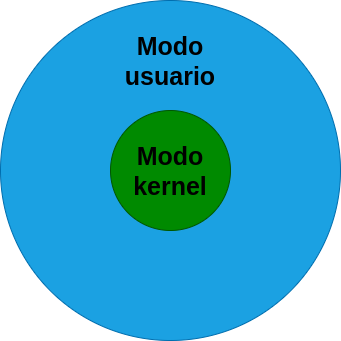

## Datos del estudiante
- **Estudiante:** Carlos Ernesto Fuentes Rasique
- **Carnet:** 201503756
- **Fecha:** 25/07/2023

## Contenido
- [Definición Kernel](#definicion)
- [Tipos de Kernel y sus diferencias](#tipos_kernel)
- [User mode vs Kernel Mode](#modo_kernel_usuario)
- [Referencias](#referencias)
---

### Definición de Kernel
El kernel es el núcleo de un sistema operativo. Es como la interfaz entre el software y el hardware. Es por ello por lo que se está usando continuamente. Resumiendo: El kernel es el corazón de un sistema operativo.

---

### Tipos de Kernel y sus diferencias
| Tipo | Descripción | Característica |
| -- | -- | -- |
| Kernel Modular | Se centran en las funcionalidades escenciales como la administracion de memoria, la planificación de procesos etc. | Tiene compilados archivos como objetos, los cuales el Kernel puede cargar o eliminar bajo demanda. Estos modulos se encuentran en /lib/modules. Lo positivo del Kernel Modular es que no hace falta reiniciarlo al efectuar algún cambio. |
| Kernel Monolítico | Se trata de un programa de tamaño considerable que se debe recompilar por completo cada vez que se quiera agregar una nueva posibilidad. | Este tipo de Kernel engloba todos los servicios del sistema, posee un rendimiento mayor que el de un micro-núcleo. Esto es posible porque todas las funcionalidades posibles están integradas con el sistema. Cualquier cambio efectuado sobre cualquier servicio requiere la re-compilación del Kernel y el reinicio del sistema para aplicar los cambios. |
| Microkernel | Proporcionan un pequeño conjunto de abstraciones simples del hardware y usan las aplicaciones llamadas servidores para ofrecer  mayor funcionalidad. | Es un tipo de núcleo de un sistema operativo que provee un conjunto de primitivas o llamadas mínimas al sistema para implementar servicios básicos como espacios de direcciones, comunicación entre procesos y planificación básica. |
| Kernel Híbrido | El kernel híbrido es un tipo de núcleo de un sistema operativo. Básicamente, es un micronúcleo que tienen mas instrucciones en espacio de núcleo.| Es más rapido que un micro kernel ya que tiene más opciones. |
| Exonúcleo | Es un tipo de núcleo con funcionalidad limitada porque asegura la protección y el multiplexado de los recursos, ya que más simple que las implementaciones del paso de mensajes y las abstracciones de hardware de los núcleos monolíticos tradicionales.  | Es muy limitado. |
| Hurd | GNU Hurd  es un conjunto de programas servidores que simulan un núcleo Unix que se establece la base del sistema operativo GNU. Este no es del todo considerado kernel.  |

---

### User mode vs Kernel Mode
| User mode | Kernel Mode |
| --- | --- |
| En este modo los programas no pueden modificar la paginación directamente, por lo tanto no se tiene la capacidad de acceder a la memoria de otros programas, excepto a través de las funciones API. Los programas en modo usuario no pueden interferir con las interrupciones y el cambio de contexto. Por ejemplo, cuando un programa quiere acceder a la cámara web, el programa debe pasar por el kernel por medio de una llamada y de esta forma realizar dicha petición.  |  Es el programa central en el que se basan todos los demás componentes del sistema operativo, se utiliza para acceder a los componentes del hardware y programar los procesos que debe ejecutarse en el sistema. Administra la interacción entrel software y hardware. Es por esta razón que es el programa más privilegiado ya que puede interactuar directamente con el hardware. |

#### Imagen de como se estructura el modo usuario y el modo kernel.

### Referncias
- [Exonúcleo](https://es.glosbe.com/es/es/Exon%C3%BAcleo)
- [Kernels Modulares y Monolíticos](http://www.nosolounix.com/2011/11/kernels-modulares-y-monoliticos.html)
- [KERNEL Y TIPOS DE KERNEL DE LOS SISTEMAS OPERATIVOS](https://www.goconqr.com/es/mapamental/32502563/kernel-y-tipos-de-kernel-de-los-sistemas-operativos)
