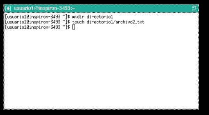

# Actividad 3
## Datos del estudiante
- **Estudiante:** Carlos Ernesto Fuentes Rasique
- **Carnet:** 201503756
- **Fecha:** 04/08/2023

## Contenido
- [Parte 1: Gestión de Usuarios](#users)
- [Parte 2: Gestión de Grupos](#groups)
- [Parte 3: Gestión de Permisos](#permissions)

---

<a name="users"></a>
### Parte 1: Gestión de Usuarios

1. Creación de Usuarios: Crea tres usuarios llamados ```usuario1```, ```usuario2``` y ```usuario3```.


2. Asignación de Contraseñas: Establece una nueva contraseñas para cada usuario creado.


3. Información de Usuarios: Muestra la información de ```usuario1``` usando el comando ```id```.


4. Eliminación de Usuarios: Elimina ```usuario3```, pero conserva su directorio principal.


---

<a name="groups"></a>
### Parte 2: Gestión de Grupos

1. Creación de Grupos: Crea dos grupos llamados ```grupo1``` y ```grupo2```.


2. Agregar Usuarios a Grupos: Agrega ```usuario1``` a ```grupo1``` y ```usuario2``` a ```grupo2```.


3. Verificar Membresía: Verifica que los usuarios han sido agregados a los grupos utilizando el comando ```groups```.


4. Eliminar Grupo: Elimina ```grupo2```.


---

<a name="permissions"></a>
### Parte 3: Gestión de Permisos

1. Creación de Archivos y Directorios:

    Como ```usuario1```, crea un archivo llamado ```archivo1.txt``` en su directorio principal y escribe algo en él.

    
    
    Crea un directorio llamado ```directorio1``` y dentro de ese directorio, un archivo llamado ```archivo2.txt```.

    

2. Verificar Permisos: Verifica los permisos del archivo y directorio usando el comando ```ls -l``` y ```ls -ld``` respectivamente.

    

3. Modificar Permisos usando ```chmod``` con Modo Numérico: Cambia los permisos del ```archivo1.txt``` para que sólo ```usuario1``` pueda leer y escribir (permisos ```rw-```), el grupo pueda leer (permisos ```r--```) y nadie más pueda hacer nada.

    

4. Modificar Permisos usando ```chmod``` con Modo Simbólico: Agrega permiso de ejecución al propietario del ```archivo2.txt```.

    

5. Cambiar el Grupo Propietario: Cambia el grupo propietario de ```archivo2.txt``` a ```grupo1```.

    

6. Configurar Permisos de Directorio: Cambia los permisos del ```directorio1``` para que sólo el propietario pueda entrar (permisos ```rwx```), el grupo pueda listar contenidos pero no entrar (permisos ```r--```), y otros no puedan hacer nada.
    

7. Comprobación de Acceso: Intenta acceder al ```archivo1.txt``` y ```directorio1/archivo2.txt``` como ```usuario2```. Nota cómo el permiso de directorio afecta el acceso a los archivos dentro de él.

    

8. Verificación Final: Verifica los permisos y propietario de los archivos y directorio nuevamente con ```ls -l``` y ```ls -ld```.

    
    
    