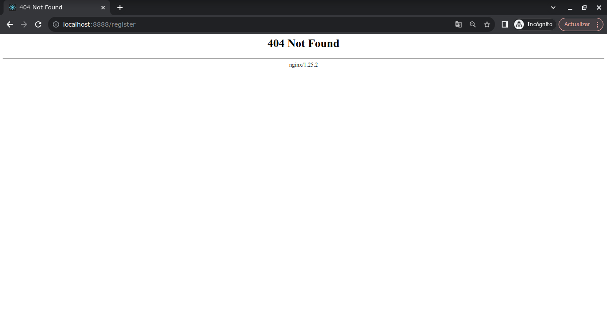
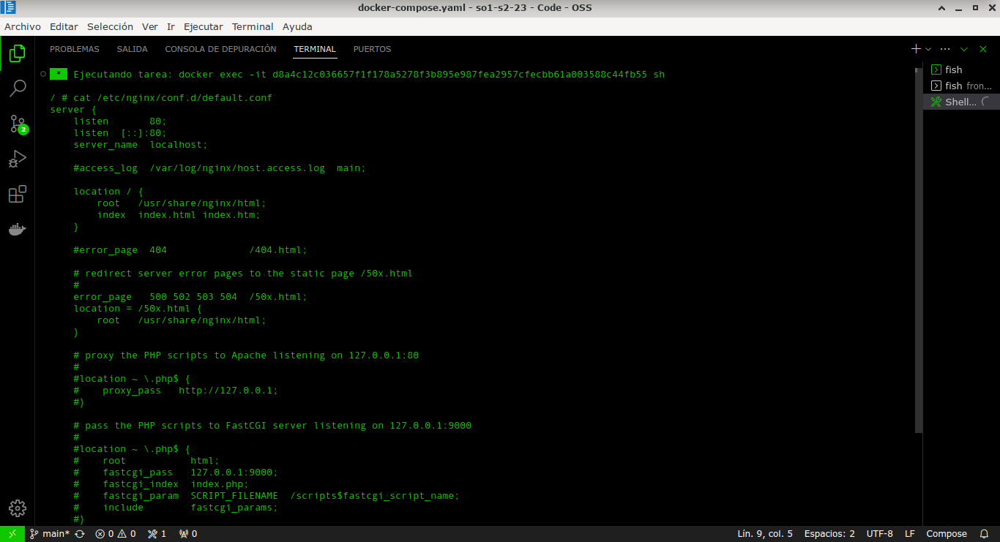
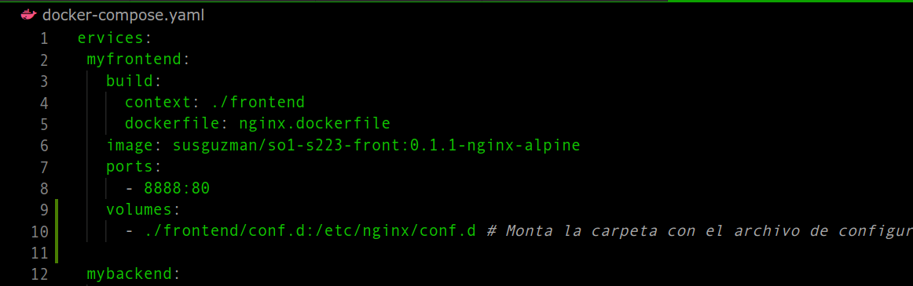
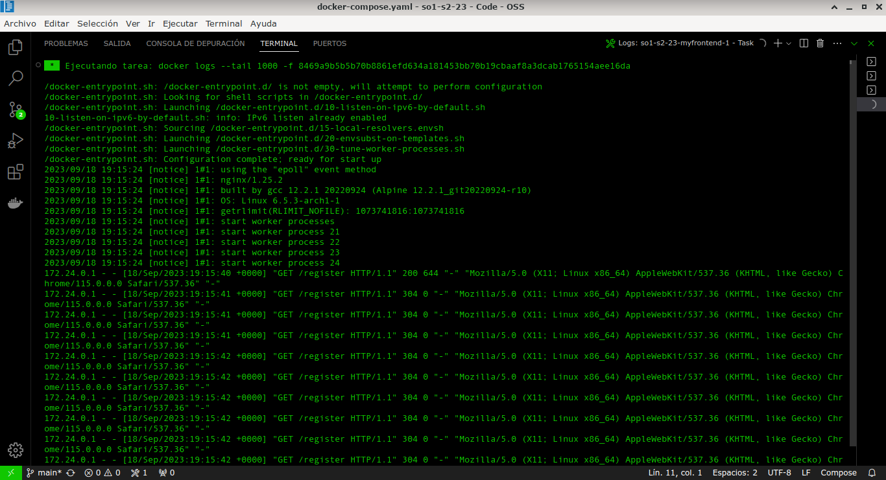

# Actividad 5: Troubleshooting frontend

## Contenido
- [Datos del estudiante](#datos)
- [Definición del problema](#problema)
- [Troubleshooting](#troubleshooting)
  - [Diagnóstico](#diagnostico)
  - [Solución](#solucion)
---

<a name="datos"></a>
## Datos del estudiante
- **Estudiante:** Carlos Ernesto Fuentes Rasique
- **Carnet:** 201503756
- **Fecha:** 18/09/2023

---

<a name="problema"></a>
## Definición del problema

El problema ocurre cuando se ejecuta el ```docker compose up -d``` para  levantar los servicios de ```database```, ```mybackend``` y ```myfrontend``` y al acceder el frontend con la ruta ```http://localhost:8888``` inicia la aplicación pero al refrescar la página muestra el siguiente error:



---

<a name="troubleshooting"></a>
## Troubleshooting

<a name="diagnostico"></a>
### Diagnóstico

Para intentar a solucionar el problema primero debemos ingresar a al contenedor del frontend con el comando ```docker logs``` para verificar el detalle del error ```404 Not found``` como se muestra a continuación:

```
2023/09/18 18:22:40 [error] 30#30: *1 open() "/usr/share/nginx/html/register" failed (2: No such file or directory), client: 172.21.0.1, server: localhost, request: "GET /register HTTP/1.1", host: "localhost:8888"
172.21.0.1 - - [18/Sep/2023:18:22:40 +0000] "GET /register HTTP/1.1" 404 555 "-" "Mozilla/5.0 (X11; Linux x86_64) AppleWebKit/537.36 (KHTML, like Gecko) Chrome/115.0.0.0 Safari/537.36" "-"
2023/09/18 18:22:40 [error] 30#30: *1 open() "/usr/share/nginx/html/register" failed (2: No such file or directory), client: 172.21.0.1, server: localhost, request: "GET /register HTTP/1.1", host: "localhost:8888"
172.21.0.1 - - [18/Sep/2023:18:22:40 +0000] "GET /register HTTP/1.1" 404 555 "-" "Mozilla/5.0 (X11; Linux x86_64) AppleWebKit/537.36 (KHTML, like Gecko) Chrome/115.0.0.0 Safari/537.36" "-"
2023/09/18 18:22:40 [error] 30#30: *1 open() "/usr/share/nginx/html/register" failed (2: No such file or directory), client: 172.21.0.1, server: localhost, request: "GET /register HTTP/1.1", host: "localhost:8888"
172.21.0.1 - - [18/Sep/2023:18:22:40 +0000] "GET /register HTTP/1.1" 404 555 "-" "Mozilla/5.0 (X11; Linux x86_64) AppleWebKit/537.36 (KHTML, like Gecko) Chrome/115.0.0.0 Safari/537.36" "-"
172.21.0.1 - - [18/Sep/2023:18:22:40 +0000] "GET /register HTTP/1.1" 404 555 "-" "Mozilla/5.0 (X11; Linux x86_64) AppleWebKit/537.36 (KHTML, like Gecko) Chrome/115.0.0.0 Safari/537.36" "-"
2023/09/18 18:22:40 [error] 30#30: *1 open() "/usr/share/nginx/html/register" failed (2: No such file or directory), client: 172.21.0.1, server: localhost, request: "GET /register HTTP/1.1", host: "localhost:8888"
```


El error anterior parece estar relacionado con cómo se manejan las rutas en la aplicación React y la configuración de nginx en dicho contenedor.

Para avanzar con esta linea de investigación, entramos al contenedor para verificar la configuración del archivo ```/etc/nginx/conf.d/default.conf```



Investigando un poco sobre las configuaciones de React y nginx encontramos esto:

**Nginx necesita reglas para manejar las rutas de React de manera adecuada. Se debe usar una regla try_files para redirigir todas las solicitudes al punto de entrada de la aplicación React.**

---

<a name="solucion"></a>
### Solución

Ya habiendo detectado el error procedemos a crear en el proyecto una carpeta ```conf.d``` y adentro de la carpeta crear un archivo llamado ```default.conf``` con la siguiente información:

```
server {
    listen       80;
    listen  [::]:80;
    server_name  localhost;

    #access_log  /var/log/nginx/host.access.log  main;

    location / {
        root   /usr/share/nginx/html;
        index  index.html;
        try_files $uri $uri/ /index.html; # Esto es importante para el enrutamiento de React
    }

    # Las demás directivas permanecen igual
    error_page   500 502 503 504  /50x.html;
    location = /50x.html {
        root   /usr/share/nginx/html;
    }
}
```
Los cambios clave en esta configuración son:

1. La línea ```try_files $uri $uri/ /index.html;``` en la sección ```location /``` permite que nginx redirija todas las solicitudes al archivo index.html. Esto es esencial para que React pueda manejar el enrutamiento del lado del cliente y evitar los errores 404 al actualizar la página.

2. Se eliminó la línea ```index index.htm;``` para asegurarse de que solo se use index.html como página de inicio. 

Para agregar esta nueva configuración del archivo ```default.conf``` a nuestro contenedor de frontend agregamos un volumen a la configuración de docker compose como se muestra a continuación:



Este volumen permite a reemplazar la configuración por defecto que tiene nginx por nuestra configuración personalizada.

Después volvemos a construir con ayuda del docker compose. Una vez construido, lo ejecutamos con ```docker compose up -d```.

Por último realizamos las pruebas para validar que ya no exista el problema original. Para ello vemos las salidas del ```log``` del contenedor.



Aquí podemos observar que ya no nos muestra el error.

---
